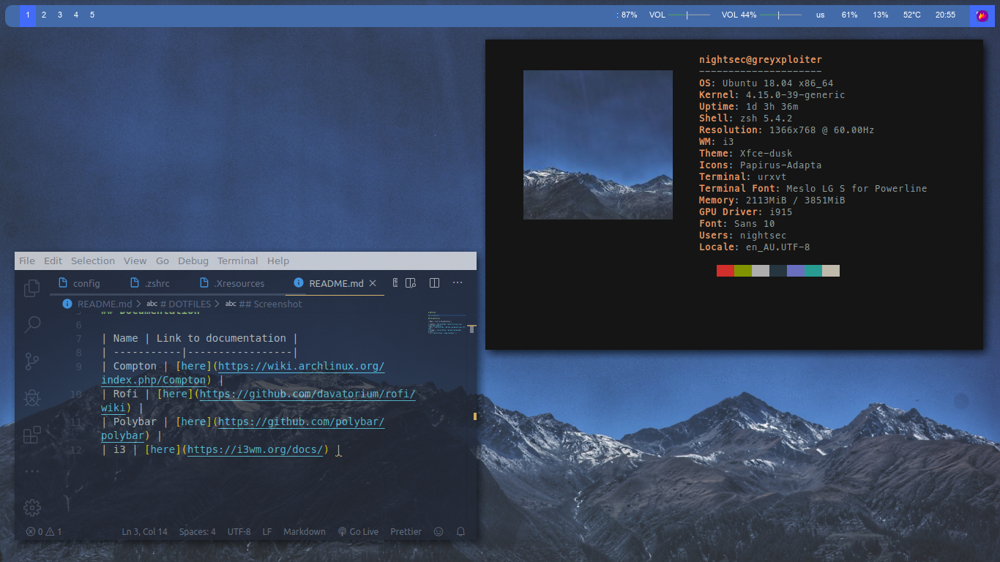
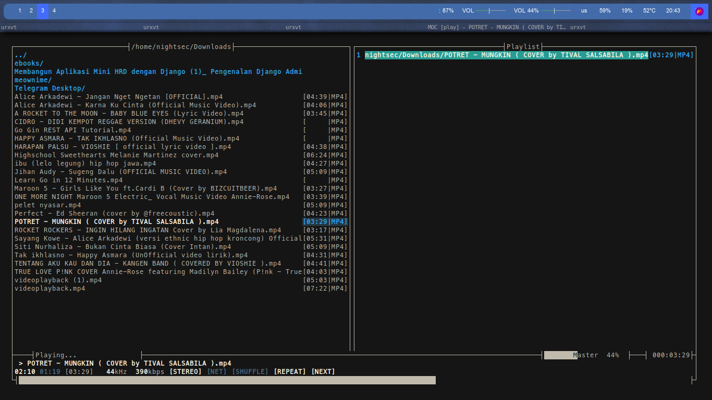
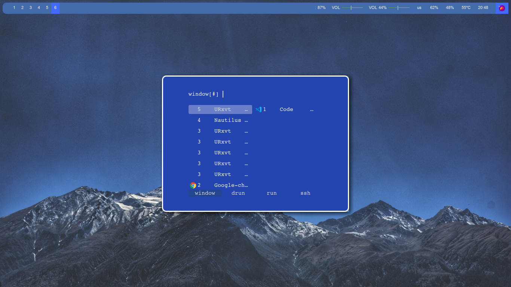
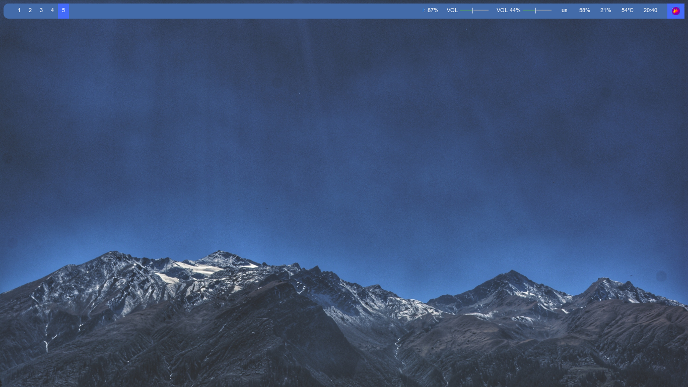
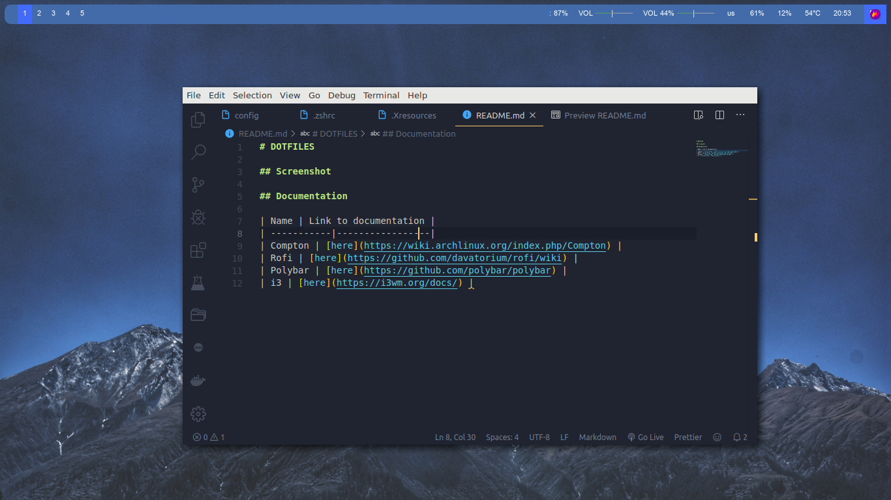

# DOTFILES

## Screenshot

## Documentation

| Name | Link to documentation |
| -----------|-----------------|
| Compton | [here](https://wiki.archlinux.org/index.php/Compton) |
| Rofi | [here](https://github.com/davatorium/rofi/wiki) |
| Polybar | [here](https://github.com/polybar/polybar) |
| i3 | [here](https://i3wm.org/docs/) |
